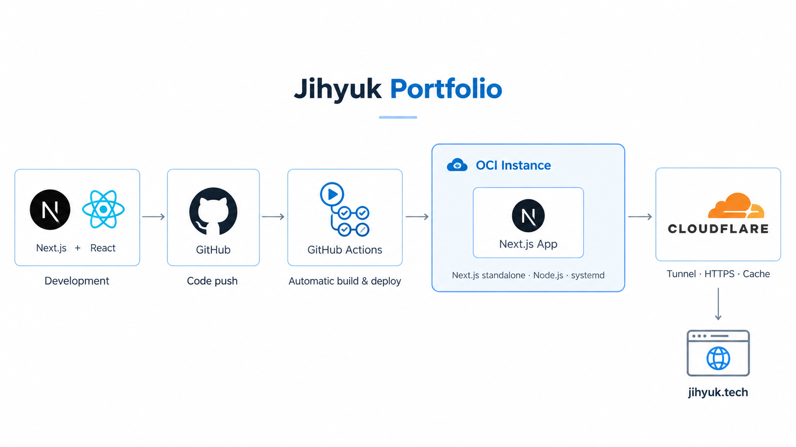
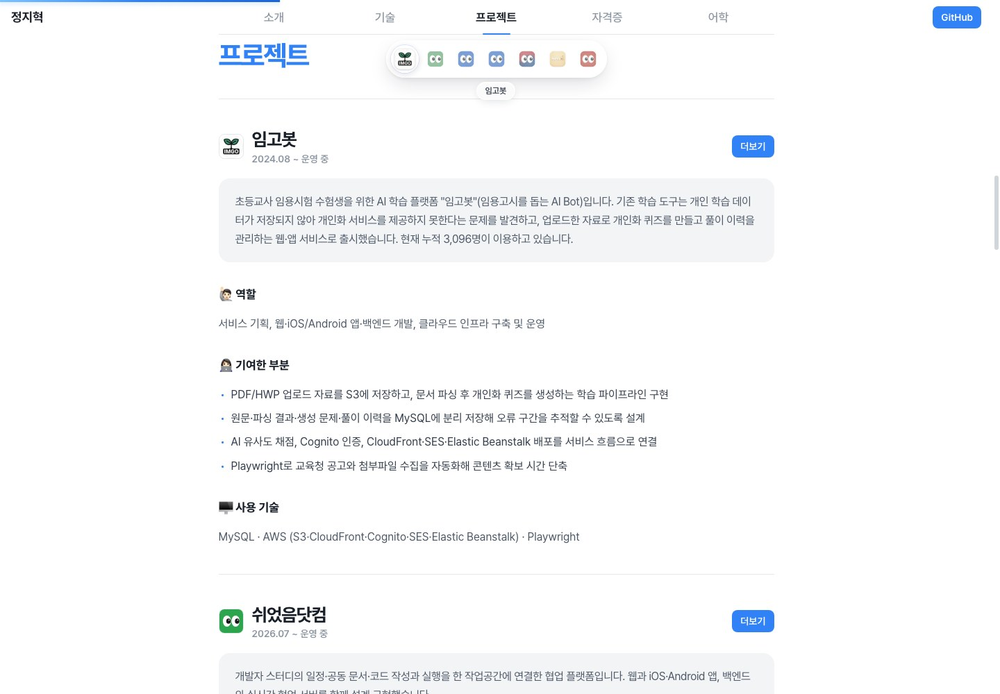
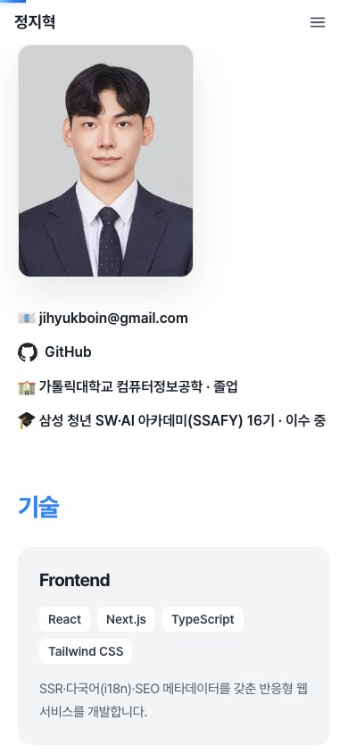

<div align="center">
  

  # Jihyuk Portfolio

  **웹·모바일·백엔드·Cloud를 연결해 실제 사용자가 있는 서비스를 만듭니다.**

  직접 기획하고 개발·운영한 서비스, 기술과 경험을 한 페이지에 담은 정지혁의 포트폴리오

  `Next.js 16` · `React 19` · `TypeScript` · `Tailwind CSS 4`

  **[포트폴리오 방문 ↗](https://jihyuk.tech)**

  [서비스 화면](#서비스-화면) · [주요 기능](#주요-기능) · [시작하기](#시작하기) · [콘텐츠 수정](#콘텐츠-수정)
</div>

---

## 서비스 화면

[](https://jihyuk.tech)

| 프로젝트 탐색 | 모바일 |
| --- | --- |
|  |  |
| 프로젝트별 역할·기여·기술을 읽고 웹 서비스와 앱으로 이동합니다. | 화면 너비에 맞춰 프로필과 콘텐츠가 자연스럽게 재배치됩니다. |

> 현재 소스를 로컬 개발 서버에서 촬영한 화면입니다.

## 이 포트폴리오에 담은 것

1. **소개와 기술** — 프로필, 학력·교육, 분야별 기술과 경험을 소개합니다.
2. **직접 만든 서비스** — 임고봇, 쉬었음닷컴, 살래말래 등 프로젝트의 문제·역할·기여를 정리하고 실제 서비스와 앱 링크를 연결합니다.
3. **자격증과 어학** — 발급 기관, 취득·응시일, 등록번호와 어학 성적을 카드로 보여 줍니다.
4. **빠른 탐색** — 현재 읽는 섹션을 강조하는 메뉴, 스크롤 진행 표시, 프로젝트 아이콘 독으로 긴 페이지를 탐색합니다.

## 주요 기능

| 영역 | 구현 |
| --- | --- |
| 반응형 화면 | 데스크톱·모바일 레이아웃, 모바일 메뉴, 가변 글자 크기와 여백 |
| 섹션 탐색 | 고정 헤더, 스크롤 위치에 따른 활성 메뉴, 페이지 스크롤 진행 표시 |
| 프로젝트 탐색 | 대표 프로젝트 우선·나머지 최신순 정렬, 프로젝트 구간에서 나타나는 반투명 아이콘 독 |
| 공유와 검색 | Canonical, Open Graph·Twitter 메타데이터, 공유 이미지 생성, robots.txt·sitemap.xml |
| 구조화된 정보 | ProfilePage·Person·프로젝트 목록 JSON-LD, 같은 콘텐츠 데이터에서 생성하는 llms.txt |
| 방문 분석 | 측정 ID를 설정한 경우에만 Google Analytics 연결 |
| 배포 | GitHub Actions 검증, OCI standalone 배포, 헬스 체크 실패 시 이전 릴리스로 복구 |

## 기술 구성

```text
app/                          페이지, 레이아웃, 메타데이터와 공개 정보 경로
components/portfolio/         소개·프로필·기술·프로젝트·자격증·어학 섹션
components/layout/            헤더·푸터·메뉴·스크롤 진행 표시·프로젝트 독
components/seo/               JSON-LD 구조화 데이터
data/portfolio.ts             프로필·프로젝트·기술·자격증·어학 데이터
lib/site.ts                   사이트 주소와 제목·설명
public/images/                프로필 사진과 프로젝트 아이콘
ops/oci/                      OCI 배포 스크립트와 systemd 설정
.github/workflows/            검증 및 운영 배포 워크플로
```

화면, 메타데이터, JSON-LD, `llms.txt`가 [data/portfolio.ts](data/portfolio.ts)를 공통으로 사용합니다. 콘텐츠를 한 곳에서 수정하면 각 출력에 함께 반영됩니다. 본문 섹션은 서버 컴포넌트로 구성하고, 스크롤 탐색과 모바일 메뉴는 클라이언트 컴포넌트로 동작합니다.

## 시작하기

### 1. 설치

배포 워크플로와 같은 **Node.js 24**를 권장합니다.

```bash
git clone https://github.com/jihyukboin/jihyuk-portfolio.git
cd jihyuk-portfolio
npm ci
```

### 2. 실행

```bash
npm run dev
```

[http://localhost:3007](http://localhost:3007)에서 확인합니다. 로컬 실행에는 별도 환경변수가 필요하지 않습니다.

사이트 주소나 방문 분석을 설정하려면 루트에 `.env.local`을 만듭니다.

```dotenv
NEXT_PUBLIC_SITE_URL=http://localhost:3007
# Google Analytics를 사용할 때만 추가합니다.
# NEXT_PUBLIC_GA_MEASUREMENT_ID=G-XXXXXXXXXX
```

`NEXT_PUBLIC_SITE_URL`은 Canonical·공유 정보·사이트맵·JSON-LD의 기준 주소입니다. 생략하면 `http://localhost:3007`을 사용합니다. `NEXT_PUBLIC_*` 값은 빌드 시 반영되므로 변경 후에는 다시 빌드합니다.

### 3. 검증과 빌드

```bash
npm run lint
npm run typecheck
npm run build
npm start
```

`npm start`의 기본 포트는 `3000`입니다. `3007`에서 빌드 결과를 확인하려면 `npm start -- --port 3007`을 사용합니다. `typecheck`는 Next.js 타입을 생성한 뒤 TypeScript 검사를 실행합니다.

## 콘텐츠 수정

| 바꾸려는 내용 | 수정 위치 |
| --- | --- |
| 프로필·기술·프로젝트·자격증·어학 | [data/portfolio.ts](data/portfolio.ts) |
| 섹션 배치 | [app/(root)/page.tsx](app/(root)/page.tsx) |
| 메뉴 이름·순서 | [components/layout/navigation.ts](components/layout/navigation.ts) |
| 사이트 제목·설명·주소 | [lib/site.ts](lib/site.ts) |
| 공유 이미지 | [app/opengraph-image.tsx](app/opengraph-image.tsx) |
| 프로필 사진·프로젝트 아이콘 | [public/images](public/images) |

프로젝트에 `featured: true`를 지정하면 대표 프로젝트로 먼저 표시됩니다. 나머지는 `startedOn` 최신순으로 정렬하며, `endedOn`을 생략하면 운영 중으로 표시합니다. 섹션 순서를 변경할 때는 메뉴 순서도 함께 맞춥니다.

## 운영 배포

```text
main push → GitHub Actions 검증 → OCI 빌드·standalone 릴리스
          → systemd 재시작·헬스 체크 → Cloudflare 콘텐츠 캐시 갱신
```

워크플로는 의존성 설치, lint, 타입 검사, 빌드를 통과한 뒤 `production` 환경으로 배포합니다. OCI에서는 릴리스 디렉터리를 만들고 현재 릴리스 링크를 교체하며, 서버는 `127.0.0.1:3010`에서 실행됩니다.

GitHub `production` 환경의 SSH 접속·사이트·Cloudflare 설정은 [배포 워크플로](.github/workflows/deploy-production.yml)를, 서버 구성과 환경변수 동기화는 [OCI 운영 문서](ops/oci/README.md)를 참고하세요.

---

<div align="center">
  <a href="https://jihyuk.tech">jihyuk.tech</a> ·
  <a href="https://github.com/jihyukboin">GitHub</a> ·
  <a href="mailto:jihyukboin@gmail.com">Email</a>
</div>
